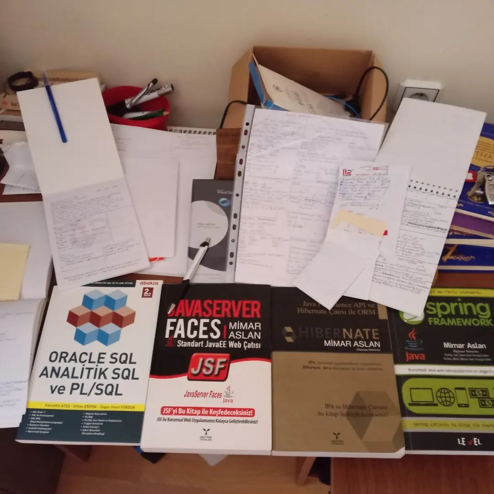

<h3>Lütfen dikkatli okuyunuz!</h3>
<h4>2014 yılında mezun oldum, 2022'ye kadar düzenli bir bilgisayarım ve internet bağlantım olmadı.</h3>
<h4>Ciddi zorluklar yaşadığım için senelerce proje yapamadım / proje dahi oluşturamadım. İnternet bağlantım ve bilgisayarım olmadığı için kağıtlar üzerinde yapmaya çalıştım. GitHub profilimin zayıf oluşu bu yüzden.</h4>
<h4>İzlediğim kurslar burada: https://www.linkedin.com/in/huseyin99/details/certifications/ </h4>

<h1 align="left">Hi 👋, I'm Hüseyin Aydın</h1>
<h3 align="left">A passionate frontend developer from Türkiye / Niğde.</h3>

<h3 align="left">Connect with me:</h3>

<h3 align="left">The library and tools I use:</h3>

                  

<b>
	Hello. My name is Huseyin Aydin. I started software when I was in high school. I want to advance and make a career in the software field. I increase my programming experience by taking trainings, writing demo projects, working on algorithms, reading books and watching seminars.
My experience in programming and software on
• Java / Java EE specifications JAX-RS (Jersey), JPA (Hibernate)
• Spring Framework (Spring Boot, MVC, Security, Data)
• Spring Cloud components & microservices frameworks.
• JavaScript (ES6, TypeScript) and frontend JS Frameworks (React and Angular)
• Testing frameworks (For Java projects JUnit)
I started high school in 2009 and finished in 2012. I finished Bor Vocational High School between 2012 and 2014. My student life did not end with graduation. It won't end until he dies. I'm an apprentice software developer trying to improve myself by getting training and reading books, that's all.

Selamlar.

11.09.1994 tarihinde Niğde’de doğdum. Niğde de ikamet ediyorum ve yaşıyorum. Babam yok, annem ev hanımı. Benimle birlikte dört kardeşiz. İlkokulu(2008), Endüstri Meslek Lisesi Web Tasarım ve Programlama bölümünü(2012), Niğde Üniversitesi Bor Meslek Yüksek Okulu Bilgisayar Programcılığı ön lisansı(2014) yıllarında bitirdim. İlk yazdığım program C# dilinde idi ve kullanıcıdan isim sorup aldığı ismi hoş geldiniz falanca kişi diye selamlıyor idi. Yazılım ile 2009 senesinde tanıştım. 2009 senesinde lise 1. sınıfa gidiyor idim. Şu an 28 yaşındayım.

Bildiğim ve sevdiğim teknolojiler;

C, C++(2014 versiyonu Cygwin derleyici ile kullanıyorum),Java, Java FX, Swing GUI, Servletler, JSP, JSF(Prime Faces), JSTL, JUnit 5, JSR 330, JSR 250, Spring Framework, Spring Web MVC, Spring Boot, Spring Boot ile Microservisler, Spring Boot ile Web Servisleri, Spring Boot ile Web Socket, Spring Security, Swagger, Lombok, çok katmanlı mimariler, MVC(Model View Controller) tasarım şablonu, Maven, Gradle, JavaScript(Ecma Script 6 ve üzeri), NodeJS, NPM, TypeScript, Angular, Struts 2(giriş seviyesi bir kaç mini demo projecik), XML, JSON, JWT, SQL, TSQL, Oracle SQL, HTML, Bootstrap(Hazır kodu tak çıkar düzenle), CSS(Hazır kodu tak çıkar düzenle), Python(giriş seviyesi), Django(bir kaç mini demo projecik), Go programlama dili(giriş seviyesi) OpenCV(Sadece yüz tespiti için kullanmıştım.), AOP, Aspect J, Android(Sadece Java ile), Jasper Reporting, JPA – Hibernate, Soap ve RESTFul Web Servisleri(Jersey ve RestEasy).
JShell kullanmayı, IDLE kullanmayı, Java 1.8 ile Lambda Expressions kullanmayı, yine Java 1.8 ile Stream API kullanmayı, yine Java 1.8 ile interface içine default ve static olarak gövdeli metot tanımlamayı, Java 1.9 ile modüller ile çalışmayı ve Java 10 ile tipi olmayan değişkenler tanımlamayı biliyorum. Java 14’ü de demo bir proje oluşturarak inceledim ve öğrendim.

Mantıken bildiğim ama ezbere bilmediğim tasarım şablonları:
Singleton Tasarım Deseni,
Thread Safe Singleton Deseni,
Factory Method Design Deseni,
Abstract Factory Design Deseni,
Prototype Deseni,
Builder Deseni,
Facade Deseni,
Adapter Deseni,
Composite Deseni,
Proxy Deseni,
Decorator Deseni,
Bridge Deseni,
Strategy Deseni,
Observer Deseni,
Chain Of Responsibility Deseni,
Memento Deseni,
Template Method Deseni,
State Deseni,
Mediator Deseni,
Command Deseni,
Visitor Deseni,
Visitor Deseni 2,
Dependency Injection Deseni,
Null Object Deseni,
Multiton Deseni.

Kullanmaya çalıştığım yazılım geliştirme prensibi: 
Single Responsibility Principle,
Open/Closed Principle,
Liskov Substitution Principle,
Interface Segregation Principle,
Dependency Inversion Principle,
Do Not Repeat Yourself Principle.

JPA ve Hibernate Framework,
Java Server Faces,
Spring Framework,
Pratik Spring Core,
Oracle SQL - Analitik SQL ve PL/SQL.

"Medium.com" makalelerim: 
Değer ve referans tipler: https://medium.com/@huseyinaydin99/javada-de%C4%9Fer-ve-referans-tipler-2fe5c79ba5ad 
Java'da interface: https://medium.com/@huseyinaydin99/javada-interface-nedir-3257b93a378a 
REST nedir? https://medium.com/@huseyinaydin99/rest-nedir-http-nedir-http-metotlar-nelerdir-7026e8647a5b 
SOLID prensibler: https://medium.com/@huseyinaydin99/solid-principle-solid-prensipler-b962d9acf055 
Spring MVC: https://medium.com/@huseyinaydin99/spring-mvc-e5d844d40a4a 
Spring Nedir? https://medium.com/@huseyinaydin99/spring-nedir-b040ddb34e6a 

Kurs videoları izlemekten göz sağlığım bozuldu, yüksek astigmat ve miyopi yüzünden kalın camlı gözlük takıyorum artık.
CV’de yazım yanlışı varsa kusura bakmayın.
Sürçü lisan ettiysem affola.

Özcan Acar:
Bir firmada gel kardeş seni yetiştirelim demiyor. Hepsi Senior bilmem ne arıyor. Bu yazılımcılar ağaçta mı yetişiyor?

Saygılar...  
Hüseyin AYDIN
