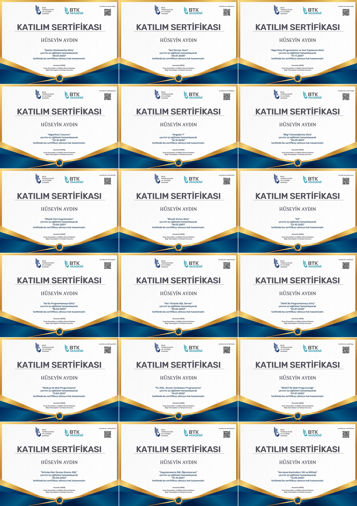

 <h3 align="center">Hi 👋, I'm Hüseyin Aydın.</h3>
 
 [](https://git.io/typing-svg)


#### السلام عليكم
#### بسم الله الرحمن الرحيم
#### :grinning::+1:
#### Hello!

<pre>
👋 I'm Hüseyin Aydın.
I'm a software developer who mostly works with the Java language. I follow other technologies as well.
I was born and raised in Türkiye / Niğde. I live in Türkiye / Niğde. I am an Anatolian child. Yes I know, I am an all-rounder!</pre>

#### Connect with me:
<a href="https://www.facebook.com/beyaz.sapkali.5/" target="blank"></a>
<a href="https://www.instagram.com/huseyin.aydin.99/" target="blank"></a>
<a href="https://www.linkedin.com/in/huseyin99/" target="blank"></a>
<a href="https://www.youtube.com/@huseyinaydin1002/" target="blank"></a>
</br></br>
#### Used Java and sub-technologies:


</br></br>

#### Used front-end technologies:


</br></br>

#### Used database technologies:


</br>
</br>

#### Used .NET technologies:


</br></br>

#### Used Version Control System:


</br>

---

#### :spiral_notepad: Öz geçmişim: 
2012 yılı yazında Niğde Endüstri Meslek Lisesi Web Programcılığı bölümünden, 2014 yılı yazında Niğde / Bor Meslek Yüksek Okulundan mezun oldum. 2022'ye kadar düzenli bir bilgisayarım ve internet bağlantım olmadı. Ciddi zorluklar yaşadığım için senelerce proje yazamadım, daha doğrusu proje dahi oluşturamadım. Basit bir maven projesi oluşturmak ve bağımlılıkları çekmek için internet bağlantısına ihtiyacım vardı. İnternet bağlantım ve bilgisayarım maddi imkanların içerisinde, maddi imkansızlıklardan dolayı olmadığından programlamayı öğrenmek adına akıllı telefondan video kurslar izleyip kağıtlar üzerinde kod yazmaya çalıştım. Benim GitHub profilim aslında bu kağıtlar ve defterler! Asla pes etme bilgisayar yoksa kağıtlar var!


#### Here are the video courses I watched and learned: [Video Courses Certificates](https://www.linkedin.com/in/huseyin99/details/certifications/ "Video Course")

---

#### :spiral_notepad: My Resume: 
##### I started high school in 2009 and finished in 2012. I finished Bor Vocational High School between 2012 and 2014. My student life did not end with graduation. It won't end until he dies. I'm an apprentice software developer trying to improve myself by getting training and reading books, that's all.
##### My experience in programming and software on
<pre>• Java / Java EE specifications JAX-RS (Jersey), JPA (Hibernate)
• Spring Framework (Spring Boot, MVC, Security, Data)
• Spring Cloud components & microservices frameworks.
• JavaScript (ES6, TypeScript) and frontend JS Frameworks (React and Angular)
• Testing frameworks (For Java projects JUnit)</pre>

### 📕 My Articles of "medium.com"

 - [Değer ve Referans Tipler.](https://medium.com/@huseyinaydin99/javada-de%C4%9Fer-ve-referans-tipler-2fe5c79ba5ad "Değer ve referans tipler")
 - [Java'da Interface.](https://medium.com/@huseyinaydin99/javada-interface-nedir-3257b93a378a "Java'da interface.")
 - [REST Nedir?](https://medium.com/@huseyinaydin99/rest-nedir-http-nedir-http-metotlar-nelerdir-7026e8647a5b "REST Nedir?")
 - [SOLID Prensibler.](https://medium.com/@huseyinaydin99/solid-principle-solid-prensipler-b962d9acf055 "Solid Prensibler")
 - [Spring MVC Nedir?](https://medium.com/@huseyinaydin99/spring-mvc-e5d844d40a4a "Spring MVC Nedir?")
 - [Spring Nedir?](https://medium.com/@huseyinaydin99/spring-nedir-b040ddb34e6a "Spring Nedir?")
 - [Monolitic Mimari SOA Mimarisi ve Microservice Mimarisi Kıyaslaması Nedir?](https://medium.com/@huseyinaydin99/monolitic-mimari-soa-mimarisi-ve-microservice-mimarisi-k%C4%B1yaslamas%C4%B1-nedir-b10bda9dc1fe "Monolitic Mimari SOA Mimarisi ve Microservice Mimarisi Kıyaslaması Nedir?")
 - [MSSQL Server’da Index kullanımı.]([[https://medium.com/@huseyinaydin99/monolitic-mimari-soa-mimarisi-ve-microservice-mimarisi-k%C4%B1yaslamas%C4%B1-nedir-b10bda9dc1fe](https://medium.com/@huseyinaydin99/mssql-serverda-index-kullan%C4%B1m%C4%B1-882f7d88ca1)](https://medium.com/@huseyinaydin99/mssql-serverda-index-kullan%C4%B1m%C4%B1-882f7d88ca1) "MSSQL Server’da Index kullanımı.")


### :chart_with_downwards_trend: Top Programming Languages:


### :bar_chart: GitHub Status:


<!-- ### 📈 Used technologies:

-->

##### Kurs videoları izlemekten göz sağlığım bozuldu, yüksek astigmat ve miyopi yüzünden kalın camlı gözlük takıyorum artık.
#### :spiral_notepad: My Certificates of BTK Akademi:


---

#### :spiral_notepad: My Certificates of Udemy:


##### CV’de yazım yanlışı varsa kusura bakmayın. Sürçü lisan ettiysem affola.
##### Özcan Acar:
Bir firmada gel kardeş seni yetiştirelim demiyor. Hepsi Senior bilmem ne arıyor. Bu yazılımcılar ağaçta mı yetişiyor?

<b>
Saygılar</br>
Hüseyin AYDIN
</b>
</font>


#### :floppy_disk: Developer CV prepared with PHP:

```php
<?php

/*
* Hüseyin Aydın's Resume v1.0 *
* I'm a full stack developer i loves Java, C#, Python and Angular... *
* Learning something new is my passion. * * @link https://www.facebook.com/beyaz.sapkali.5/,huseyinaydin99@gmail.com,https://github.com/huseyinaydin99*
*/

DEFINE("Who am I?", "I am Huseyin Aydin.");

// Education Experience
$education1 = array(
"name" => "Udemy", "link" => "https://www.udemy.com/", "info" => array(
"date" => array("June 2012", "April 2020"),
" education_received" => "Full Stack Developer",
"techs" => array("Java", "C#", "Spring Framework", "Hibernate", "RESTful", "Database")
);

// Education Experience 2
$education2 = array(
"name" => "BTK ", "link" => "https://www.btkakademi.gov.tr/portal/", "info" => array(
"date" => array("May 2020", "September 2020"),
"education_received" => "Full Stack Developer",
"techs" => array("Java", "Angular 10", "MySQL", "Oracle")
);

//Skills
$skills = array("Java", "C#", "Python", "Scala", "Java FX", "C", "C++", "Cygwin Compiler", "Javascript",
"Node.JS", "Angular", "Linux", "Soap Web Services", "Swing GUI", "Spring Framework", "Spring Seurity",
"CSS", "XHTML", "CSS3", "Bootstrap 5", "Swagger", "Lombok", "Spring Microservices", "ORM",
"Hibernate", "Entity Framework", "HTML5", "JSON", "XML", "Maven", "Gradle");
$me = array_merge($education1, $education2, $skills);
$company = YourCompany();
$company -> hire($me);

?>
```

<center>
<picture>
  <source
    media="(prefers-color-scheme: dark)"
    srcset="https://raw.githubusercontent.com/platane/snk/output/github-contribution-grid-snake-dark.svg"
  />
  <source
    media="(prefers-color-scheme: light)"
    srcset="https://raw.githubusercontent.com/platane/snk/output/github-contribution-grid-snake.svg"
  />
  
</picture>
</center>

#### ما شاء الله
#### لا حول ولا قوّة إلاّ بالله


